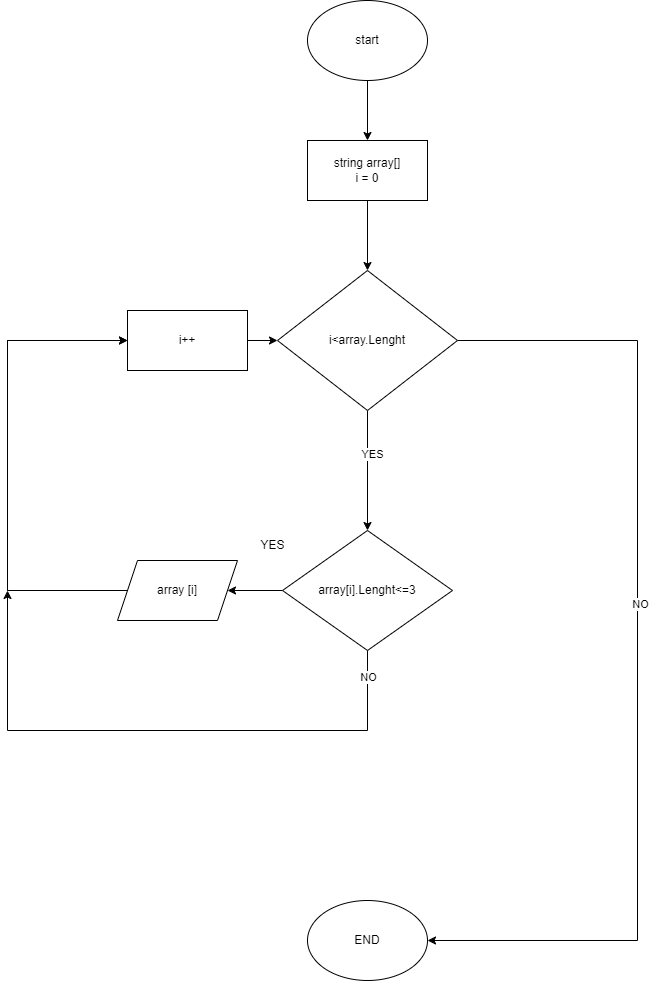

Создаем репозиторий на GitHub https://github.com/NikiMur/ControlWork.git

рисуем блок схему в Draw Io

пишем код
 
1.Задали массив и определили длину массива

2.перебрали массив

3.вывели значения введенного массива массивы

4.Выполняем условия задачи, вывод элементов массива не больше 3 